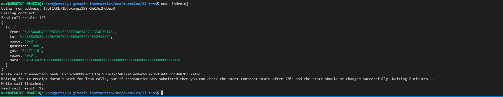

## 1. A screenshot of the accounts you created (account list) in ckb-cli.

## 2. A link to the Layer 1 address you funded on the Testnet Explorer.
https://explorer.nervos.org/aggron/address/ckt1qyqzp86m64cr24fv3djplr8z8sr3wcpey3fq3f3yl5

## 3. A screenshot of the console output immediately after you have successfully submitted a CKByte deposit to your Tron account on Layer 2.

## 4. A screenshot of the console output immediately after you have successfully issued a smart contract calls on Layer 2.

## 5. The transaction hash of the "Contract call" from the console output (in text format).
0x832b7d74a625e51c60b48b0805c0b39781acc2f154a68dd11a0351b0a6105cac
## 6. The contract address that you called (in text format).
0x2888eDb88a3766f7d78C5b965df87434E3241636
## 7. The ABI for contract you made a call on (in text format).
[
  {
    "inputs": [],
    "stateMutability": "payable",
    "type": "constructor"
  },
  {
    "inputs": [
      {
        "internalType": "uint256",
        "name": "x",
        "type": "uint256"
      }
    ],
    "name": "set",
    "outputs": [],
    "stateMutability": "payable",
    "type": "function"
  },
  {
    "inputs": [],
    "name": "get",
    "outputs": [
      {
        "internalType": "uint256",
        "name": "",
        "type": "uint256"
      }
    ],
    "stateMutability": "view",
    "type": "function"
  }
];
## 8. Your Tron address (in text format).
TBuf1tUb71Djoxmmgz19YrGmKJuZHCUmpU
