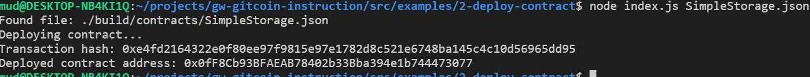

## 1. A screenshot of the console output immediately after you have successfully deployed a smart contract.

## 2. The transaction hash from the contract deployment (in text format).
0xe4fd2164322e0f80ee97f9815e97e1782d8c521e6748ba145c4c10d56965dd95
## 3. The deployed contract address from the contract deployment (in text format).
0x0fF8Cb93BFAEAB78402b33Bba394e1b744473077
