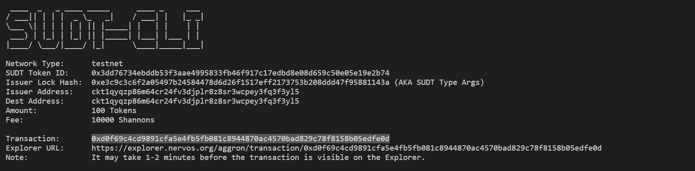

## 1. A link to the Layer 1 address you funded on the Testnet Explorer.
https://explorer.nervos.org/aggron/address/ckt1qyqzp86m64cr24fv3djplr8z8sr3wcpey3fq3f3yl5
## 2. A screenshot of the console output immediately after using sudt-cli to create your SUDT tokens on Layer 1.

## 3. A link to the transaction ID created by sudt-cli on the Testnet Explorer.
https://explorer.nervos.org/aggron/transaction/0xd0f69c4cd9891cfa5e4fb5fb081c8944870ac4570bad829c78f8158b05edfe0d
## 4. A screenshot of the console output immediately after you have successfully submitted a deposit to Layer 2 using the account-cli tool.
## 5. The SUDT ID from the console output after executing the deposit script (in text format).
