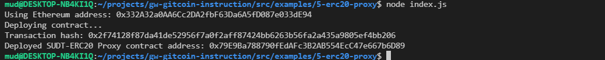
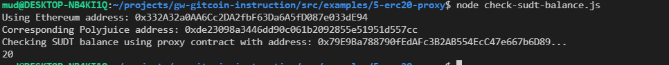

## 1. A screenshot of the console output immediately after deploying smart contract.

## 2. The address of the ERC20 Proxy Contract you deployed (in text format).
0x79E9Ba788790fEdAFc3B2AB554EcC47e667b6D89
## 3. A screenshot of the console output immediately after checking your SUDT balance.

## 4. The Ethereum address that was checked (in text format).
0x332A32a0AA6Cc2DA2fbF63Da6A5fD087e033dE94
