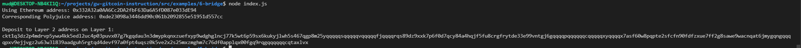

## 1. A screenshot of the console output immediately after you have successfully generated your Deposit Receiver Address.

## 2. Your Deposit Receiver Address (in text format).
ckt1q3dz2p4mdrvp5ywu4kk5edl2uc4p03puvx07g7kgqdau3n3dmypkqnxzuefxyp9wdghglncj77k5wt6p59sx6kukyjlwh5s467qgp8m25yqqqqqsqqqqqvqqqqqfjqqqqrqs89dz9xxk7p6f0d7qcy84a4hqjf5fu8crgfrytde33e99vntgj6gqqqqpqqqqqqcqqqqqxyqqqqx7asf60w8pqpte2sfcfn90fdfzxue7ff2g8sawe9wacnqat6jmygqngqqqqpxv9ejjvgz2u63w3l839aadguh5rgtqd4devf97a0fpt4uqsz0k5ve2x2s25mxzmghm7c76df0applqx00fgq9rqgqqqqqqcqtaxlvx
## 3. The Ethereum address used to generate the Deposit Receiver Address (in text format).
0x332A32a0AA6Cc2DA2fbF63Da6A5fD087e033dE94
## 4. A link to the Etherscan explorer for the successful Force Bridge transaction. This can be found on Force Bridge under History→Succeed.
https://rinkeby.etherscan.io/tx/0x55dcdf27ffd14b41c5125cf11bff17a0a111cd0892c4721503f6ca1cd2a17c9f
## 5. A link to the Nervos explorer for the successful Force bridge transaction. This can be found on Force Bridge under History→Succeed.
https://explorer.nervos.org/aggron/transaction/0xecde2cf23b0ba1e2ff0e544673f28c512e6d4ce3da9d2a77e291a61b0a5a78cb
