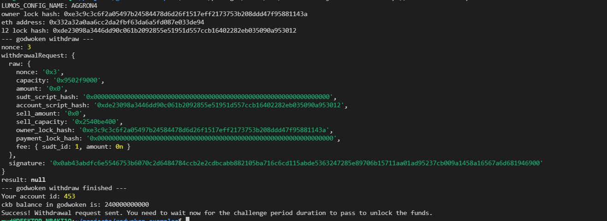

## 1. A screenshot of the console output immediately after running the withdraw command.

## 2. The Ethereum address that you've used for your Layer 2 account (in text format).
0x332a32a0aa6cc2da2fbf63da6a5fd087e033de94
## 3. The Nervos Layer 1 address that you passed to withdraw command (in text format).
ckt1qyqzp86m64cr24fv3djplr8z8sr3wcpey3fq3f3yl5
